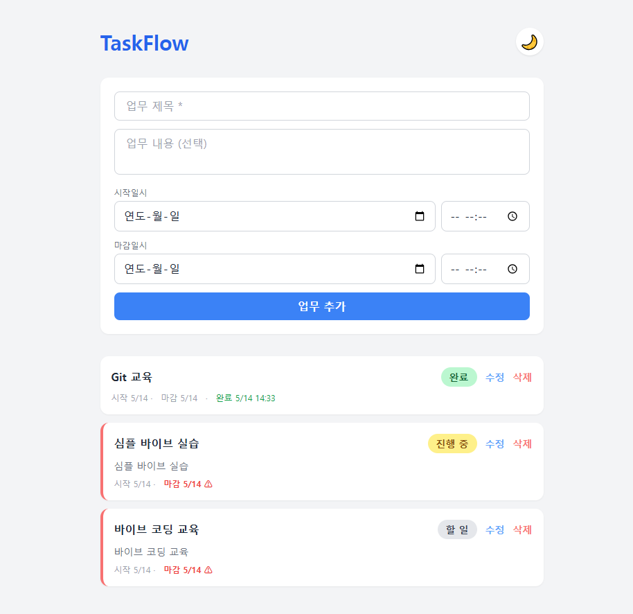
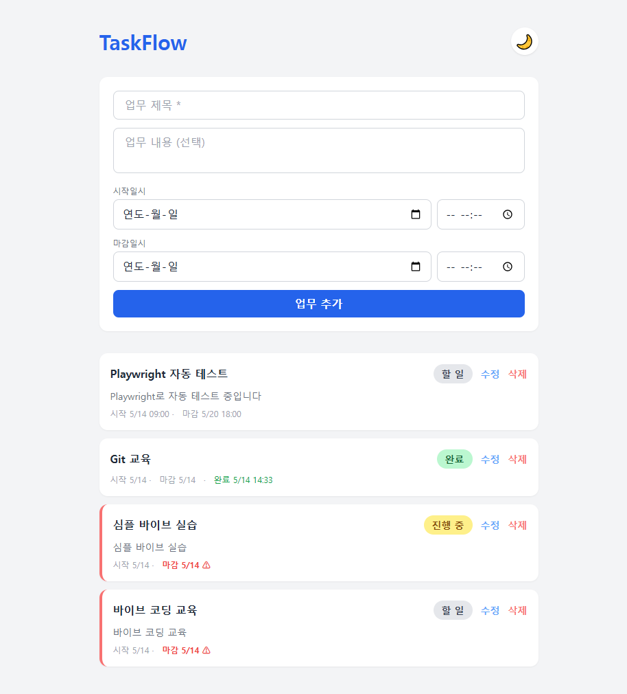
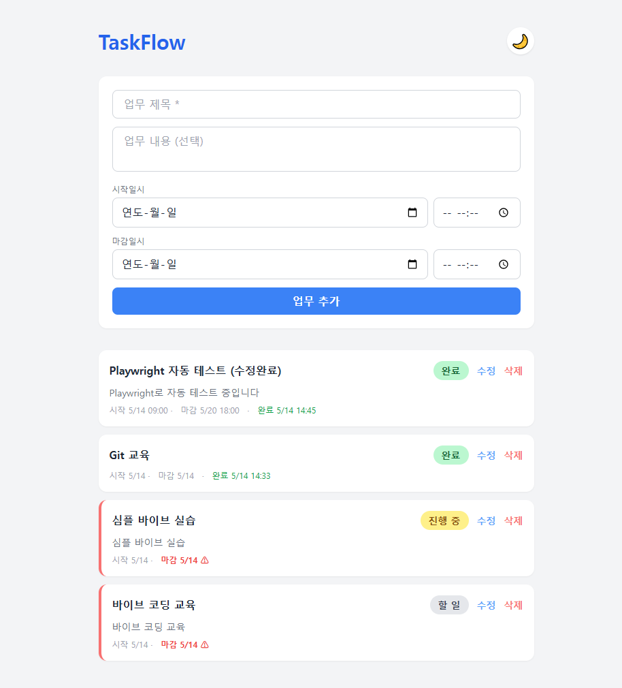
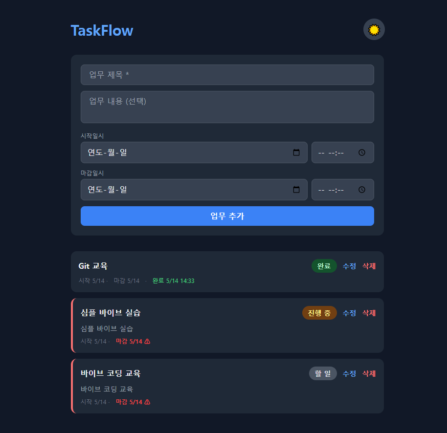

# TaskFlow 기능 테스트 보고서

- **테스트 일시:** 2026-05-14
- **테스트 도구:** Playwright (MCP Plugin)
- **테스트 대상:** http://localhost:8000
- **기술 스택:** FastAPI + SQLite / Vanilla JS + Tailwind CDN

---

## 테스트 환경

| 항목 | 내용 |
|------|------|
| OS | Windows 10 Pro |
| Python | 3.14.4 |
| Node.js | 24.15.0 |
| 서버 | uvicorn (FastAPI) |
| 포트 | 8000 |

---

## 테스트 결과 요약

| 총 테스트 | 성공 | 실패 |
|-----------|------|------|
| 6 | 6 | 0 |

---

## 상세 테스트 결과

### TC-01. 초기 화면 로딩

- **설명:** 앱 접속 시 업무 추가 폼과 기존 업무 목록이 정상 표시되는지 확인
- **결과:** ✅ 통과
- **확인 사항:** 업무 제목, 내용, 시작일시, 마감일시 입력 폼 / 기존 업무 카드(완료·진행 중·할 일) 정상 렌더링

---

### TC-02. 업무 추가

- **설명:** 제목, 내용, 시작일시, 마감일시를 입력 후 추가 버튼 클릭
- **입력값:**
  - 제목: `Playwright 자동 테스트`
  - 내용: `Playwright로 자동 테스트 중입니다`
  - 시작일시: `2026-05-14 09:00`
  - 마감일시: `2026-05-20 18:00`
- **결과:** ✅ 통과
- **확인 사항:** 목록 최상단에 새 업무 카드 추가, 시작일시·마감일시 시간 포함 정상 표시

---

### TC-03. 상태 변경

- **설명:** 상태 버튼 클릭으로 `할 일 → 진행 중 → 완료` 순환 전환
- **결과:** ✅ 통과
- **확인 사항:**
  - 상태 배지 색상 변경 (회색 → 노랑 → 초록)
  - `완료` 전환 시 완료일시 자동 기록 (`완료 5/14 14:45`)

---

### TC-04. 인라인 수정

- **설명:** 수정 버튼 클릭 시 카드가 편집 폼으로 전환, 제목 수정 후 저장
- **수정값:** `Playwright 자동 테스트` → `Playwright 자동 테스트 (수정완료)`
- **결과:** ✅ 통과
- **확인 사항:** 파란 테두리 편집 모드 진입, 저장 후 변경된 제목 반영, 기존 날짜·상태 유지

---

### TC-05. 업무 삭제

- **설명:** 삭제 버튼 클릭 시 해당 업무 카드 제거
- **결과:** ✅ 통과
- **확인 사항:** `Playwright 자동 테스트 (수정완료)` 카드 목록에서 즉시 제거

---

### TC-06. 다크모드 전환

- **설명:** 우상단 🌙 버튼 클릭 시 다크모드 전환, ☀️ 버튼으로 변경
- **결과:** ✅ 통과
- **확인 사항:** 배경·카드·입력 폼 전체 다크 테마 적용, 상태 배지 다크 색상 적용

---

## 발견된 이슈

없음

---

## 결론

TaskFlow의 핵심 기능(업무 추가·수정·삭제·상태변경·다크모드) 전 항목이 정상 동작함을 확인하였습니다.
